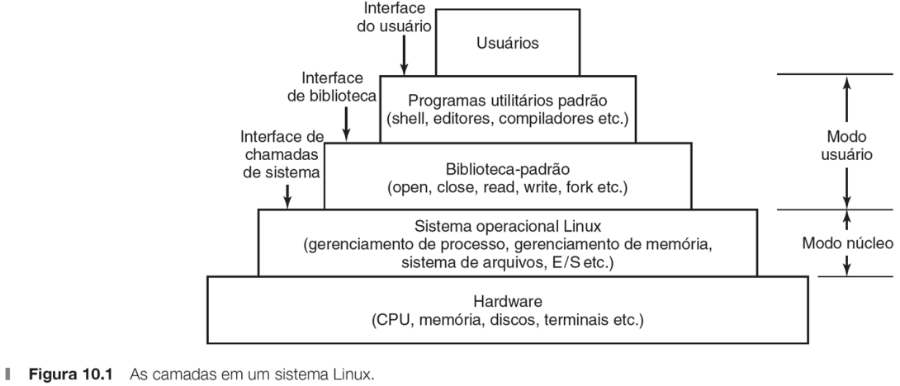
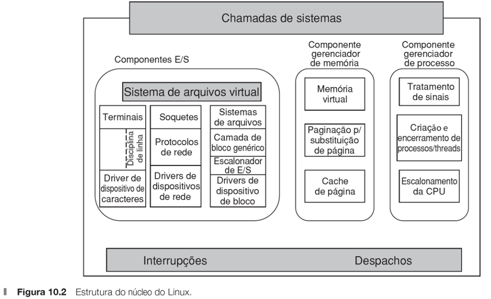
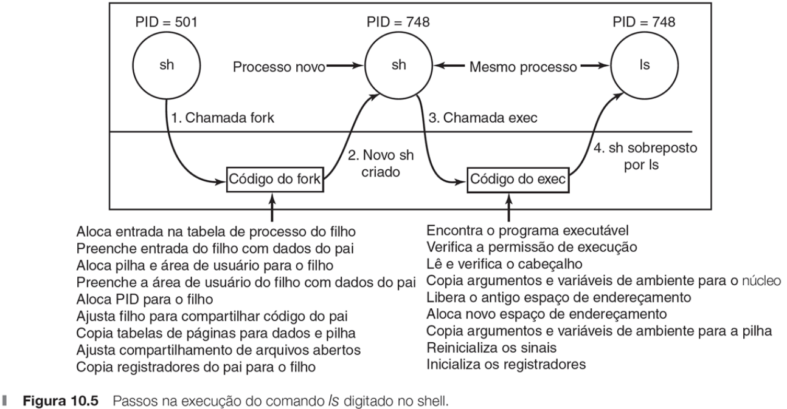

# Estudo de caso 1: Linux
*Retirado do roteiro de aula do Prof. Gustavo S. Pavani, CMCC/UFABC.*

## Sistema Linux
- Chamadas de sistema.
  - É fornecido um procedimento de biblioteca para cada chamada
    de sistema.
  - A interface dessa biblioteca é especificada pela POSIX
    (*Portable Operating System Interface*).
  - Manual disponível com o comando `man 2 system_call`, em que
    `system_call` é o nome da chamada de sistema.

  

## Estrutura do núcleo do Linux
- Três componentes principais:
  1. Entrada e Saída (E/S).
  2. Gerenciamento de memória.
  3. Gerenciamento de processo.

  

## Sinais em Linux
- **Sinais** (*signals*) permitem a comunicação inter-processo
  através de interrupções de software.
  - Um processo envia um sinal a outro processo, o qual pode:
    1. Ignorá-lo;
    2. Capturá-lo; ou
    3. Forçá-lo a morrer.
  - Um processo pode apenas mandar um sinal para o seu
    **grupo de processos**, que consiste do seu pai (e ancestrais),
    irmãos e filhos (e descendentes).
    - Todos os membros de um grupo de processos podem receber um
      sinal com uma única chamada de sistema.
  - Ver a lista de sinais em `man 7 signal`.
  - O terminal pode enviar sinais aos processos. Ver as combinações
    em `man 3 termios`.

| Sinal     | Efeito                                                                      |
| --------- | --------------------------------------------------------------------------- |
| `SIGABRT` | Enviado para abortar um processo e forçar o despejo de memória (core dump). |
| `SIGALRM` | O relógio do alarme disparou.                                               |
| `SIGFPE`  | Ocorreu um erro de ponto flutuante (por exemplo, divisão por 0).            |
| `SIGHUP`  | A linha telefônica que o processo estava usando caiu.                       |
| `SIGILL`  | O usuário pressionou a tecla DEL para interromper o processo.               |
| `SIGQUIT` | O usuário pressionou uma tecla solicitando o despejo de memória.            |
| `SIGKILL` | Enviado para matar um processo (não pode ser capturado ou ignorado).        |
| `SIGPIPE` | O processo escreveu em um pipe que não tem leitores.                        |
| `SIGSEGV` | O processo referenciou um endereço de memória inválido.                     |
| `SIGTERM` | Usado para requisitar que um processo termine elegantemente.                |
| `SIGUSR1` | Disponível para propósitos definidos pela aplicação.                        |
| `SIGUSR2` | Disponível para propósitos definidos pela aplicação.                        |

## Chamadas de sistema para gerenciamento de processos no Linux

| Chamada de sistema                   | Descrição                                             |
| ------------------------------------ | ----------------------------------------------------- |
| `pid = fork()`                       | Cria um processo filho idêntico ao pai.               |
| `pid = waitpid(pid, &statioc, opts)` | Espera o processo filho terminar.                     |
| `s = execve(name, argv, envp)`       | Substitui a imagem da memória de um processo.         |
| `exit(status)`                       | Termina a execução de um processo e retorna o status. |
| `s = sigaction(sig, &act, &oldact)`  | Define a ação a ser tomada nos sinais.                |
| `s = sigreturn(&context)`            | Retorna de um sinal.                                  |
| `s = sigprocmask(how, &set, &old)`   | Examina ou modifica a máscara do sinal.               |
| `s = sigpending(set)`                | Obtém o conjunto de sinais bloqueados.                |
| `s = sigsuspend(sigmask)`            | Substitui a máscara de sinal e suspende o processo.   |
| `s = kill(pid, sig)`                 | Envia um sinal para um processo.                      |
| `residual = alarm(seconds)`          | Ajusta o relógio do alarme.                           |
| `s = pause()`                        | Suspende o chamador até o próximo sinal.              |

## Implementação de processos no Linux

- O núcleo do Linux representa os processos internamente como **tarefas** (*tasks*).
  - Representado pela estrutura `task_struct`, que é definida em `<linux/sched.h>`.
  - O núcleo organiza todos os processos em uma lista duplamente encadeada
    de estrutura de tarefas, chamada lista de tarefas.
    - Processo identificado pelo seu **identificador de processos**
      (PID - *Process IDentifier*).
- Estrutura de tarefas possui diversos [campos].
  - Ocupa cerca de 1,7 KB de memória em uma máquina de 32 bits.
  - Contém toda informação que o núcleo tem sobre o processo.
- Exemplo de criação de um processo no Linux: usuário digita o comando 
  `ls` no *shell*.

  

[campos]: http://www.tldp.org/LDP/tlk/ds/ds.html

## Roteiro - Criando processos no Linux

1. Uso da chamada de sistema `fork`.
   1. Compile e execute o programa `prog1.c`. Explique o seu funcionamento,
      detalhando o uso das chamadas de sistema usadas.
   1. Envie o sinal `SIGINT` ao processo filho: `kill -SIGINT PID`, em que
      `PID` é o PID do processo filho mostrado na tela. O que aconteceu
      nesse caso? Justifique.

## Roteiro - Usando sinais no Linux

2. Sinais como condições de erro.
   1. Compile e execute o programa `prog2.c`. Por que o processo
      filho é terminado?
   2. Compile e execute o programa `prog3.c`. Por que o processo
      filho é terminado?
3. Como tratar um sinal?
   1. Compile e execute o programa `prog4.c`. Em uma segunda execução,
      envie o sinal `SIGINT` ao processo filho. Compare as duas execuções
      e comente. O que é necessário fazer para tratar um sinal?
   2. Modifique o programa `prog4.c` para tratar a condição de erro
      do programa `prog3.c`. Foi possível tratar o sinal e continuar
      a execução? Justifique.
4. Como mascarar um sinal?
   1. Compile e execute o programa `prog5.c`. Durante sua execução,
      envie o sinal `SIGQUIT` ao processo filho. Em uma segunda execução,
      envie o sinal `SIGTERM` ao processo filho. Compare as duas execuções
      e comente. O que é necessário fazer para mascarar um sinal?
   2. É possível tratar ou mascarar o sinal `SIGKILL` ou `SIGSTOP`? Justifique.

## Roteiro - Trabalhando com Pthreads no Linux

5. Criação de threads.
   1. Compile com a opção `-pthread` o programa `prog6.c`. Execute-o
      várias vezes e comente sobre as saídas. Explique o funcionamento
      do programa.
   2. Compile com a opção `-pthread` o programa `prog7.c`. Execute-o
      várias vezes e comente sobre as saídas. Qual a solução para
      o problema apresentado?
6. Implementando a exclusão mútua.
   1. Compile com a opção `-pthread` o programa `prog8.c`. Execute-o
      várias vezes e comente sobre as saídas.

## Roteiro - Troca de mensagens

7. Produtor-consumidor com troca de mensagens.
   1. Compile com a opção `-o cons` o programa `prog9c.c`. Compile
      com a opção `-o prod` o programa `prog9p.c`. Execute os programas
      `cons` e `prod` em diversas combinações. Explique o funcionamento
      dos programas.
   1. Modifique os programas `prog9c.c` e `prog9p.c` para implementar
      o sistema produtor-consumidor com `N` mensagens da Figura 2.29
      do livro texto (Aula 3 - página 30), mas fazendo uso de caixa postal.
