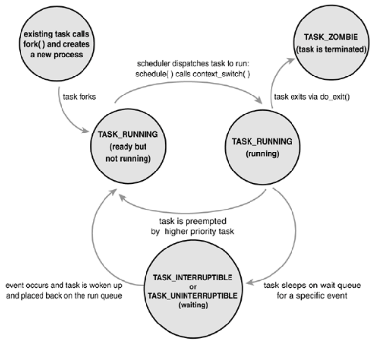

# Escalonamento no Linux
*Retirado do roteiro de aula do Prof. Gustavo S. Pavani, CMCC/UFABC.*

## Histórico

- Da versão de **kernel** 2.5 a 2.6.22.
  - Padrão: `O(1)` *scheduler*.
  - Descrição na Seção 10.3.4 do livro texto.
- Da versão 2.6.23 (Outubro de 2007) em diante.
  - Padrão: *Completely Fair Scheduler* (CFS).

# Estados dos processos

- Cinco estados possíveis para um processo:
  1. `TASK_RUNNING`: O processo é executável. Ele pode estar em execução
     ou pronto na fila do escalonador para execução futura.
  2. `TASK_INTERRUPTIBLE`: O processo está bloqueado esperando por
     alguma condição. O processo também acorda se receber um sinal.
  3. `TASK_UNINTERRUPTIBLE`: Idêntico ao estado anterior, com exceção de
     não acordar ao receber um sinal.
  4. `TASK_ZOMBIE`: O processo terminou, mas o processo pai não executou
     a chamada de sistema `wait4`.
  5. `TASK_STOPPED`: A execução do processo foi parada pelo recebimento
     dos sinais `SIGSTOP`, `SIGSTSTP`, `SIGTTIN` ou `SIGTTOU` ou de qualquer
     sinal enquanto o processo estava sendo depurado. O processo pode voltar
     a execução quando receber um sinal `SIGCONT`, por exemplo.

  

## Comandos úteis

- Examinando os processos executando no Linux.
  - Execute o comando `top` e verifique o estado dos processos em execução.
  - Siga o [tutorial].
- Examinando o estado instantâneo dos processos no Linux.
  - Veja o manual do comando `ps`, executando-o em seguida.
  - Tutorial sobre o [/proc].
- Examinando a árvore de processos.
  - Execute o comando `pstree 1` e verifique a árvore completa de processos.

[tutorial]: http://linoxide.com/linux-command/linux-top-command-examples-screenshots/
[/proc]: https://www.maketecheasier.com/proc-filesystem-examine-linux-inner-working/

## Roteiro - Escalonamento de threads

1. Política de escalonamento e prioridades
   1. Compile com a opção `-pthread` e execute o programa `prog1.c`.
      Veja as opções do programa e execute cada uma delas. É necessário
      ser usuário `root` para alguma delas.

      - Dicas:
        - `man 2 sched_setscheduler` para informações sobre as políticas
          de escalonamento e parâmetros.
        - Informações sobre as mínimas e máximas prioridades do sistema
          podem ser obtidas com o comando `chrt -m` (pacote `util-linux`)
          ou com as funções `sched_get_priority_min` e `sched_get_priority_max`.

## Roteiro - Problema Produtor-Consumidor

2. Uso de variáveis de condição
   1. Compile com a opção `-pthread` e execute o programa `prog2.c`.
      Explique o uso das variáveis de condição no código do programa.

## Roteiro - Problema do Jantar dos Filósofos

3. Impasse
   1. Compile com a opção `-pthread` e execute o programa `prog3.c`.
      O que aconteceu na saída? Justifique.
   2. Compile com a opção `-pthread` e execute o programa `prog4.c`,
      que é baseado na Figura 2.38 do livro texto. O problema do
      programa anterior foi resolvido? Justifique.

## Roteiro - Problema dos Leitores e Escritores

4. Inanição (*starvation*) e desempenho
   1. Compile com a opção `-pthread` e execute o programa `prog5.c`.
      O que aconteceu na saída? Justifique.
   2. Compile com a opção `-pthread` e execute o programa `prog6.c`.
      O problema do programa anterior foi resolvido? Há espaço para
      melhoria de desempenho da leitura no código?
   3. Compile com a opção `-pthread` e execute o programa `prog7.c`.
      Houve melhoria de desempenho na leitura em relação ao programa
      anterior? Justifique.

      - Dica:
        - Use o comando `time programa` para mostrar o tempo de execução
          de um `programa` depois da saída.
