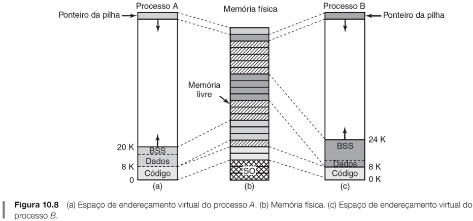
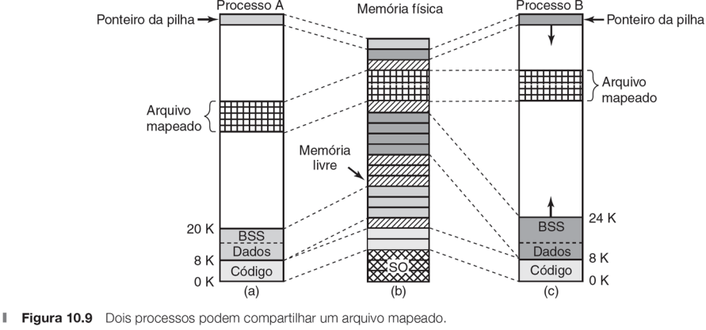
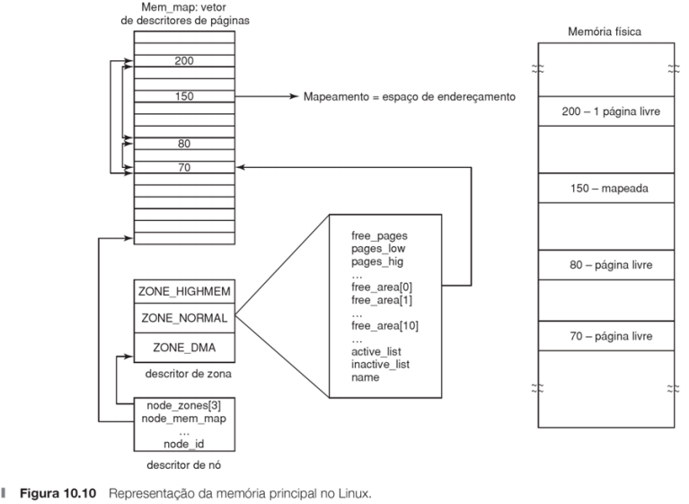
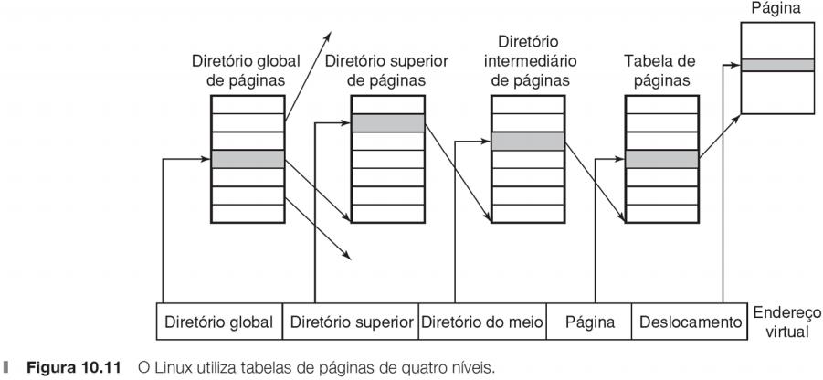

# Gerenciamento de Memória no Linux
*Retirado do roteiro de aula do Prof. Gustavo S. Pavani, CMCC/UFABC.*

## Espaço endereçamento Linux

  

- Consiste em três segmentos: código, dado e pilha.  
  - **BSS** (*Block Started by Symbol*) contém os dados não inicializados.
  - O Linux provê suporte a **segmentos de códigos compartilhados** (b) e (c).

## Arquivos mapeados em memória no Linux

- O Linux permite mapear arquivos em uma parte do espaço de endereçamento
  do processo.
  - Aumenta o desempenho de leitura e escrita.
  - Como dois ou mais processos podem compartilhar um mesmo arquivo mapeado,
    se cria um mecanismo bastante eficiente de compartilhamento de memória.

  

## Chamadas de sistema para gerenciamento de memória no Linux

- O POSIX não especifica quaisquer chamada de sistema para gerenciamento
  de memória, por ter sido considerado muito dependente da máquina.
- As chamadas mais comuns estão representadas na tabela abaixo.
  - Veja mais informações com o comando `man 2`.

| Chamada de sistema                             | Descrição                             |
| ---------------------------------------------- | ------------------------------------- |
| `s = brk(addr)`                                | Altera o tamanho do segmento de dados |
| `a = mmap(addr, len, prot, flags, fd, offset)` | Mapeia um arquivo na memória          |
| `s = unmap(addr, len)`                         | Remove o mapeamento do arquivo        |

## Implementação do gerenciamento de memória no Linux

- O Linux faz distinção entre três tipos de zonas de memória:

  1. **ZONE_DMA**: páginas utilizadas para operações de DMA.
  2. **ZONE_NORMAL**: páginas normais regularmente mapeadas.
  3. **ZONE_HIGHMEM**: páginas com endereços de memória altos, que
     não são permanemtemente mapeadas.

- A memória principal é formada por três partes.
  - As duas primeiras, o núcleo e o mapa de memória, estão fixas na
    memória (as páginas nunca são removidas).
    - O mapa de memória contém todas as informações sobre o uso da memória
      física no sistema, como suas zonas, molduras de páginas livres, etc.
    - Vetor de **descritores de páginas** (*mem_map*) para cada moldura
      de página física no sistema. O tamanho do descritor de página é de
      32 bytes, de modo que o mapa de memória consome somente uma pequena
      parte da memória física.
  - O restante da memória está dividido em molduras de páginas.
    - Cada uma dessas molduras pode conter uma página de código, dados
      ou pilha, uma tabela de páginas ou estar em uma lista livre.

  

## Tabela de páginas do Linux

- O Linux utiliza uma tabela de página de 4 níveis.
  - Cada endereço virtual é decomposto em cinco campos.
    - Nota: a partir da versão 4.12 do Linux (07/2017), suporte para
      tabela de página de 5 níveis implica em um salto de 64 TB para
      128 PB de endereçamento virtual.

  

## Paginação no Linux

- Sistema Linux trabalha por demanda de páginas, sem pré-paginação
  e sem conceito de conjunto de trabalho.
  - **Daemon de página - kswapd** (*Kernel swap daemon*)
    - De forma periódica, ele verifia se existem páginas suficientes
      por meio comparação dos marcadores com o uso atual da memória
      em cada zona da memória.
    - Se houver memória suficiente, ele simplesmente volta a dormir.
    - Entretanto, se a memória disponível para cada uma das zonas
      estiver abaixo de um limite, ele inicia o **algoritmo de
      recuperação de molduras de páginas** (*Page Framing Reclaiming
      Algorithm* - PFRA).
    - A cada execução, apenas um pequeno número de páginas é reclamado
      para limitar a pressão de E/S.
  - Segmentos de texto e arquivos mapeados são paginados para os seus
    respectivos arquivos no disco.
    - O restante é paginado para a partição que forma a **área de troca**.

## Roteiro - Algoritmos de alocação de memória

1. Algoritmos de alocação de memória livre.
   1. Compile e execute o programa `prog1.c`. Que algoritmo de alocação
      de memória livre foi usado para `s5` e `s6`? Justifique.

## Roteiro - Tamanho de página e de segmento de dados

2. Descobrindo o tamanho de página.
   1. Compile e execute o programa `prog2.c` com a *flag* `-lm` após 
      `prog2.c`. Qual o tamanho de página do sistema obtida pela 
      chamada de sistema `getpagesize`?
   2. Instale o pacote `hugepages` e descubra o tamanho das páginas
      suportadas com o comando `pagesize -a`. Por que é importante
      suportar outros tamanhos de página, além do padrão?
3. Alterando o tamanho do segmento de dados.
   1. Compile e execute o programa `prog3.c`. Remova o comentário
      abaixo de "Acarretaria SEGMENTATION_FAULT" e recompile e 
      reexecute o programa. Por que ocorreu um *segmentation fault*?

## Roteiro - Arquivos mapeados em memória

4. Memória compartilhada.
   1. Compile e execute o programa `prog4.c`. Examine o conteúdo do
      arquivo `test_mmap.txt`. Quais as vantagens e desvantagens de
      se mapear um arquivo em memória?
   2. Compile e execute o programa `prog5.c`. O que aconteceu com o
      conteúdo do arquivo `teste_mmap.txt`?

## Roteiro - Faltas de página

5. Verificando a quantidade de faltas de páginas.
   1. Compile e execute o programa `prog6.c`. O laço usado na função
      `preenche_lento` é a forma mais eficiente de iteração sobre
      uma matriz? Justifique.
   2. Modifique o programa `prog6.c` para aumentar o desempenho do
      laço. Houve redução no número de faltas de página em relação
      ao programa anterior? Justifique.

      - Dica: use o comando `/usr/bin/time -v` para medir o tempo
      de processamento de cada programa.
6. Estatísticas.
   1. Use o comando `ps -o min_flt,maj_flt,cmd PID` para enxergar as
      estatísticas de falta de páginas de um processo `PID`.
   2. Use o comando `top`, tecle `F` e selecione as faltas de página.
   3. Use o comando `/usr/bin/time -v CMD` para obter estatísticas
      de um programa executado `CMD`.
